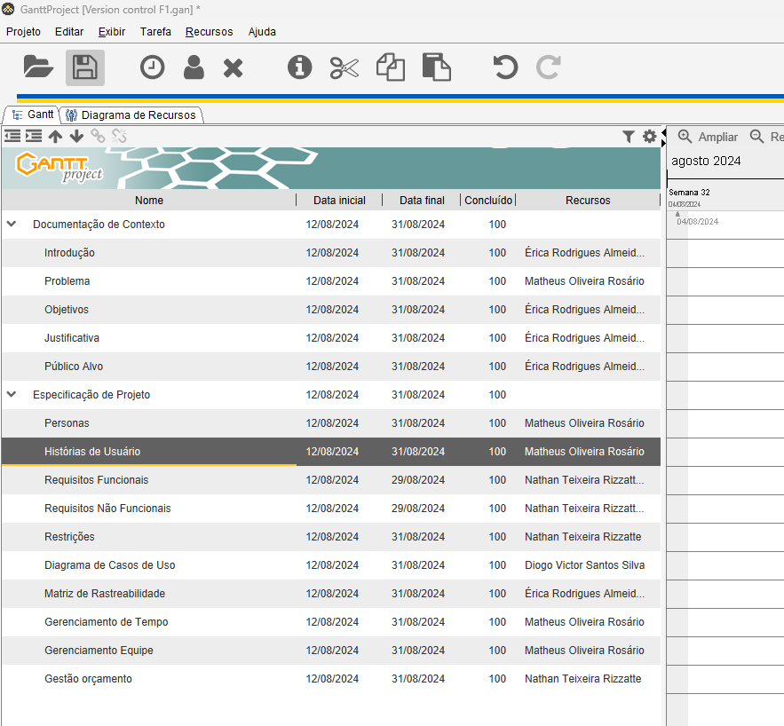
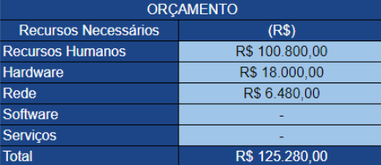

# Especificações do Projeto

## Personas

||**Gabriela Rocha**|
**29 anos**

**Ocupação: Analista de Qualidade em uma empresa de pequeno porte.** 

|
| :- | :-: | :- |
|
Motivações:
 Deseja armazenar os documentos da Qualidade em um repositório oficial. |
Frustrações:

Não consegue que os trabalhadores da produção, utilizem as instruções de trabalho atualizadas.
|
Hobbies/História:

Gosta de pesquisar sobre tecnologias; busca sempre estar atualizada na área de Qualidade. Gosta de ler livros de terror.
|

||Sabrina|
**42 anos**

**Ocupação: Gerente de projetos na FullTech** 

|
| :- | :-: | :- |
|
Motivações:
 Gostaria de ter uma ferramenta para armazenar todos os formulários de testes e seus resultados. |
Frustrações:

Dificuldade para consultar resultados de testes realizados.
|
Hobbies/História:

Iniciou a sua trajetória na FullTeck a 15 anos. Busca soluções Ágeis para o dia a dia de sua empresa. 
|

||José Jr|
**22 anos**

**Ocupação: Estudante de História**

|
| :- | :-: | :- |
|
Motivações:
 Busca um repositório de fácil acesso para arquivar resumos de livros. |
Frustrações:

Tem dificuldade com aplicações com várias interfaces de funcionalidades.
|
Hobbies/História:

Passa o dia todo na faculdade estudando e realizando monitorias. Nós finais de semana, gosta de sair com os amigos.
|

||Bruno|
35 anos

**Ocupação: Gerente de RH na UsinagemTop** 

|
| :- | :-: | :- |
|
Motivações:
 Deseja um sistema para arquivar a documentação dos funcionários. |
Frustrações:

Fica sobrecarregada ao armazenar a documentação em meio físico. 
|
Hobbies/História:

Assumiu recentemente a função nessa empresa, com a missão de organizar toda a parte documental de RH.
|

## Histórias de Usuários

A partir da compreensão do dia a dia das personas identificadas para o projeto, foram
registradas as seguintes histórias de usuários:

|EU COMO... `PERSONA`| QUERO/PRECISO ... `FUNCIONALIDADE` |PARA ... `MOTIVO/VALOR`                 |
|--------------------|------------------------------------|----------------------------------------|
|Jose Jr  | Eu desejo uma plataforma que simplifique a compreensão e a navegação de todas as aplicações e arquivos, independentemente da complexidade de suas interfaces ou funcionalidades. Esta plataforma deve oferecer uma experiência intuitiva e unificada, permitindo-me acessar e interagir com todas as ferramentas e dados de forma eficiente e sem esforço, capacitando-me a atingir seu máximo potencial em qualquer ambiente digital.           | Ter uma solução que me permita gerir de forma mais eficiente todos os meus livros e arquivos escritos. Esta solução deve oferecer recursos avançados de organização, pesquisa e acesso rápido, independentemente da quantidade de livros ou documentos que eu possua. Quero ser capaz de categorizar, etiquetar e encontrar facilmente qualquer livro ou arquivo, além de poder sincronizá-los em diferentes dispositivos para acesso conveniente em qualquer momento e lugar. Essa solução deve simplificar meu fluxo de trabalho e tornar a gestão dos meus materiais escritos uma tarefa simples e eficaz.               |
|Gabriela Rocha      | Eu desejo um repositório oficial altamente seguro e eficiente para armazenar todos os documentos relacionados à qualidade da minha organização. Este repositório deve oferecer recursos avançados de organização e categorização, garantindo fácil acesso e recuperação rápida de documentos quando necessário. Além disso, desejo que o repositório tenha capacidades de controle de versão para garantir a integridade e rastreabilidade dos documentos ao longo do tempo. Quero uma solução que cumpra com os mais altos padrões de segurança de dados para proteger informações sensíveis e confidenciais, proporcionando tranquilidade e conformidade regulatória à minha organização.             | Ter uma solução que garanta que os trabalhadores da produção utilizem sempre as instruções de trabalho atualizadas. Esta solução deve ser fácil de implementar e usar, integrando-se perfeitamente ao ambiente de trabalho existente. Deve oferecer notificações automáticas e lembretes para os trabalhadores sempre que uma instrução de trabalho for atualizada, garantindo que eles estejam cientes das mudanças. Além disso, a solução deve fornecer acesso rápido e intuitivo às instruções de trabalho mais recentes, seja por meio de dispositivos móveis, terminais de trabalho ou outros meios de comunicação utilizados na produção. Quero uma solução que promova a conformidade e a eficiência operacional, garantindo que as práticas de trabalho estejam sempre alinhadas com os padrões mais atualizados da empresa. |
| Bruno | Eu desejo um sistema completo e eficiente para arquivar a documentação dos funcionários da minha organização. Este sistema deve ser fácil de usar, permitindo o armazenamento organizado de documentos como currículos, contratos, registros de treinamento, avaliações de desempenho e outros documentos relevantes. Além disso, desejo que o sistema tenha recursos avançados de segurança, garantindo a proteção dos dados confidenciais dos funcionários. Quero a capacidade de acessar rapidamente qualquer documento, fazer pesquisas por palavras-chave e gerenciar permissões de acesso para diferentes usuários. Esta solução deve simplificar e agilizar o processo de gerenciamento de documentos dos funcionários, promovendo a conformidade e facilitando a tomada de decisões baseada em dados. | Ter uma solução digital robusta e eficiente para a gestão de documentação, eliminando a sobrecarga associada ao armazenamento em meio físico. Esta solução deve oferecer uma plataforma centralizada e segura para armazenar, organizar e acessar todos os documentos da minha organização. Quero recursos avançados de digitalização e indexação para converter documentos físicos em formatos digitais pesquisáveis e facilmente acessíveis. Além disso, desejo que a solução tenha opções de backup automático e controle de versão para garantir a integridade e segurança dos documentos. Quero uma solução escalável que possa acompanhar o crescimento da minha organização e oferecer acesso rápido e fácil aos documentos de qualquer lugar, a qualquer momento, reduzindo significativamente a carga de trabalho associada ao armazenamento em meio físico. |
| Sabrina | Eu desejo uma ferramenta intuitiva e abrangente para armazenar todos os formulários de testes e seus resultados de forma organizada e acessível. Esta ferramenta deve permitir o upload fácil de formulários de teste em vários formatos, como PDF, Word ou Excel, e facilitar a categorização e marcação dos formulários para uma recuperação rápida. Além disso, desejo funcionalidades avançadas para registrar e analisar os resultados dos testes, incluindo a capacidade de adicionar notas, atribuir pontuações e gerar relatórios detalhados. Quero uma solução que promova a colaboração entre os membros da equipe, permitindo compartilhar facilmente os formulários e resultados, além de oferecer opções de segurança para proteger informações sensíveis. Essa ferramenta deve melhorar a eficiência e precisão do processo de teste, proporcionando uma visão abrangente e detalhada do desempenho em testes | Ter uma solução eficiente e acessível para consultar os resultados de testes realizados. Esta solução deve oferecer uma interface intuitiva e fácil de usar, permitindo que os usuários localizem rapidamente os resultados dos testes desejados. Quero recursos avançados de pesquisa e filtragem que me permitam encontrar resultados com base em diferentes critérios, como data do teste, tipo de teste ou resultado específico. Além disso, desejo que a solução forneça uma visualização clara e concisa dos resultados, incluindo gráficos e métricas relevantes, para facilitar a interpretação e análise dos dados. Quero uma solução que seja acessível de qualquer dispositivo, permitindo-me consultar os resultados dos testes em qualquer lugar, a qualquer momento, eliminando assim qualquer dificuldade associada à consulta de resultados. |

## Requisitos

As tabelas que se seguem apresentam os requisitos funcionais e não funcionais que detalham o escopo do projeto. Para determinar a prioridade de requisitos, aplicar uma técnica de priorização de requisitos e detalhar como a técnica foi aplicada.

### Requisitos Funcionais

|ID    | Descrição do Requisito  | Prioridade |
|------|-----------------------------------------|----|
|RF-01| Desenvolva um serviço de armazenamento de documentos que permita aos usuários fazer o upload de arquivos para a plataforma. Esse serviço deve suportar diferentes tipos de arquivos, garantir o progresso de upload, aplicar validações, etc.| ALTA | 
|RF-02|Crie um serviço de gestão de documentos que permita aos usuários organizar os arquivos em categorias e implementar funcionalidades de busca. Esse serviço deve se integrar com o serviço de armazenamento para recuperar e exibir os documentos.| MÉDIA |
|RF-03|Desenvolva um serviço de visualização e edição de documentos que permita aos usuários interagir com os arquivos armazenados na plataforma. Esse serviço deve ser capaz de renderizar diferentes tipos de arquivos e fornecer funcionalidades de edição.  | ALTA |
|RF-04| Crie um serviço de controle de versão que acompanhe as alterações feitas nos documentos, permitindo que os usuários visualizem e restaurem versões anteriores.| MÉDIA |
|RF-05| O sistema deve permitir que os usuários gerem relatórios sobre o uso de documentos, como o número de acessos, documentos mais utilizados e histórico de edições.| BAIXA |
|RF-06|Crie um serviço de autenticação e autorização que gerencie o cadastro e login dos usuários na plataforma. | Alta |
|RF-07|O sistema deve permitir que os usuários façam upload de documentos em diversos formatos (PDF, DOCX, JPG, etc.) tanto na versão web quanto na versão móvel. | ALTA |
|RF-08|O sistema deve permitir que os usuários adicionem anotações e comentários nos documentos, facilitando a colaboração e o feedback em equipe.| BAIXA |
|RF-09|O sistema deve permitir que os usuários compartilhem documentos com outros usuários, podendo definir permissões de acesso (visualização, edição) para cada compartilhamento.| ALTA |
|RF-10|O sistema deve enviar notificações aos usuários quando documentos compartilhados forem alterados, permitindo que eles estejam cientes de atualizações relevantes. | MÉDIA |
|RF-11|O sistema deve permitir que os usuários adicionem tags a documentos para facilitar a categorização e a busca, além de permitir filtros baseados em tags.| BAIXA |
|RF-12|O sistema deve permitir que os usuários visualizem e editem documentos offline, sincronizando as alterações quando a conexão com a internet estiver disponível.| MÉDIA |

### Requisitos não Funcionais

|ID     | Descrição do Requisito  |Prioridade |
|------|-----------------------------------------|----|
|RNF-01|Otimize o desempenho dos serviços, especialmente os de armazenamento, visualização e edição de documentos, para garantir uma experiência ágil aos usuários.| ALTA | 
|RNF-02|Desenhe a arquitetura de forma a permitir que a plataforma lide com um grande volume de documentos e usuários simultâneos sem degradar o desempenho.| ALTA |
|RNF-03|Desenvolva os serviços de forma a serem acessíveis por diferentes plataformas, como aplicativos móveis (iOS e Android) e aplicações web.| MÉDIA |
|RNF-04|O aplicativo deve ser compatível com diferentes plataformas, como iOS e Android, para permitir acesso em dispositivos móveis | MÉDIA |
|RNF-05|Crie uma interface intuitiva e de fácil utilização para os serviços, minimizando a curva de aprendizado dos usuários. | BAIXA |
|RNF-06|O sistema deve implementar criptografia para o armazenamento de documentos e autenticação de usuários, garantindo que apenas usuários autorizados possam acessar ou modificar os documentos. | ALTA |

## Restrições

O projeto está restrito pelos itens apresentados na tabela a seguir.

|ID| Restrição                                             |
|--|-------------------------------------------------------|
|RE-01|Agende reuniões semanais com a equipe de desenvolvimento todas as segundas-feiras a partir das 18:30h. |
|RE-02|Entregue o projeto completo no dia 08/12/2024.|
|RE-03|Mantenha o repositório das entregas no GitHub Classroom.      |
|RE-04|Garanta que a plataforma seja compatível com as ferramentas de acessibilidade dos sistemas operacionais iOS e Android.       |
|RE-05|Certifique-se de que a plataforma atenda às normas da Lei Geral de Proteção de Dados (LGPD).     |

## Diagrama de Casos de Uso

# Matriz de Rastreabilidade

| ID do Requisito | Descrição do Requisito                                                                                              | Caso de Teste                                          | Status  |
|-----------------|--------------------------------------------------------------------------------------------------------------------|--------------------------------------------------------|---------|
| RF-001          | Exibir os detalhes do trecho, incluindo horário de partida e chegada, aeroporto de origem e destino, companhia aérea, número do voo, duração, classe, informações de conexão ou escala, data e dia da semana, e total de horas de voo. | CT-001: Validar exibição de detalhes completos do trecho de voo | Pendente |
| RF-002          | Exibir detalhes dos valores, incluindo passagens, taxa de embarque, impostos, encargos, valor total, valor em pontos, e valor final a pagar, com formatação em moeda local. | CT-002: Verificar a exibição detalhada dos valores e formatação em moeda local | Pendente |
| RF-003          | Exibir regras de bagagem, incluindo informações sobre bagagem despachada, bagagem de mão e item pessoal, com ícones representativos e textos explicativos. | CT-003: Testar a clareza e organização das informações de bagagem | Pendente |
| RNF-001         | Garantir que as informações sejam exibidas de forma clara e acessível ao usuário, seguindo as melhores práticas de usabilidade. | CT-004: Avaliar a clareza e acessibilidade das informações apresentadas | Pendente |
| RNF-002         | Garantir que os valores sejam exibidos corretamente, utilizando formatação adequada em moeda local.                  | CT-005: Validar a precisão e formatação dos valores exibidos | Pendente |
| RNF-003         | Assegurar que a performance do sistema seja adequada para fornecer uma experiência de usuário satisfatória, sem atrasos significativos. | CT-006: Testar o desempenho do sistema durante a busca e exibição dos resultados | Pendente |

# Gerenciamento de Projeto

Para realizar o Gerenciamento do Projeto, optamos por utilizar a ferramenta gratuita GanttProject.

## Gerenciamento de Tempo

## Gerenciamento de Equipe

## Gestão de Orçamento

