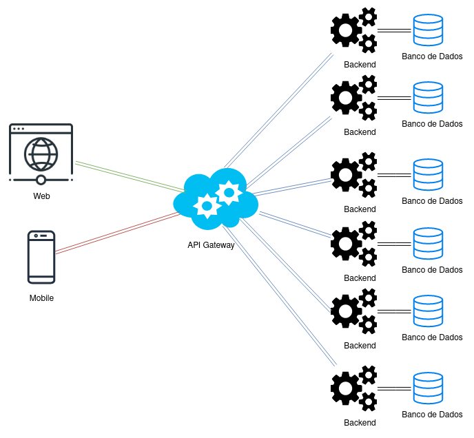

# Arquitetura da Solução

<span style="color:red">Pré-requisitos: <a href="3-Projeto de Interface.md"> Projeto de Interface</a></span>

Definição de como o software é estruturado em termos dos componentes que fazem parte da solução e do ambiente de hospedagem da aplicação.



## Diagrama de Classes

O diagrama de classes ilustra graficamente como será a estrutura do software, e como cada uma das classes da sua estrutura estarão interligadas. Essas classes servem de modelo para materializar os objetos que executarão na memória.

As referências abaixo irão auxiliá-lo na geração do artefato “Diagrama de Classes”.

> - [Diagramas de Classes - Documentação da IBM](https://www.ibm.com/docs/pt-br/rational-soft-arch/9.6.1?topic=diagrams-class)
> - [O que é um diagrama de classe UML? | Lucidchart](https://www.lucidchart.com/pages/pt/o-que-e-diagrama-de-classe-uml)

## Documentação do Banco de Dados MongoDB

Este documento descreve a estrutura e o esquema do banco de dados não relacional utilizado por nosso projeto, baseado em MongoDB. O MongoDB é um banco de dados NoSQL que armazena dados em documentos JSON (ou BSON, internamente), permitindo uma estrutura flexível e escalável para armazenar e consultar dados.

## Esquema do Banco de Dados
### Coleção: users
Armazena as informações dos usuários do sistema.

Estrutura do Documento

```Json
{
  "_id": {
    "$oid": "670196168665658e8afd8bd1"
  },
  "name": "Matheus Oliveira Rosario",
  "email": "matheus_rosario@hotmail.com.br",
  "password": "123",
  "roles": "Admin"
}
```

#### Descrição dos Campos
> - <strong>_id:</strong> Identificador único do usuário gerado automaticamente pelo MongoDB.
> - <strong>name:</strong> Nome completo do usuário.
> - <strong>email:</strong> Endereço de email do usuário.
> - <strong>passwordHash:</strong> Hash da senha do usuário.
> - <strong>roles:</strong> Lista de papéis atribuídos ao usuário (por exemplo, admin, user).

### Coleção: Document
Armazena as informações dos documentos disponíveis no sistema.

```Json
{
  "_id": {
    "$oid": "67018b888665658e8afd8bc1"
  },
  "titulo": "relatorios de teste",
  "conteudo": "relatorio digital",
  "proprietario": "Nathan",
  "tipo_documento": "docs",
  "data_criacao": "04/10/2024",
  "data_atualizacao": "05/10/2024"
}
```

#### Descrição dos Campos
> - <strong>_id:</strong> Identificador único do usuário gerado automaticamente pelo MongoDB.
> - <strong>titulo:</strong> Titulo do documento.
> - <strong>conteudo:</strong> Contéudo do documento.
> - <strong>proprietario:</strong> criador do documento.
> - <strong>tipo_documento:</strong> Formato do documento.
> - <strong>data_criacao:</strong> Data de criação do documento.
> - <strong>data_atualizacao:</strong> Data da última atualização dos dados do documento.

### Coleção: DocumentStorage
Armazena os documentos salvos no banco de dados do sistema.

Estrutura do Documento

```Json
{
  "_id": {
    "$oid": "66ea21c1b279c4db4846eb9e"
  },
  "titulo": "Título do Documento 1",
  "conteudo": "Conteúdo do documento 1 aqui.",
  "tipo_arquivo": "pdf",
  "data_criacao": "03/10/2024"
}
```

#### Descrição dos Campos
> - <strong>_id:</strong> Identificador único do produto gerado automaticamente pelo MongoDB.
> - <strong>titulo:</strong> Titulo do documento.
> - <strong>conteudo:</strong> Contéudo do documento.
> - <strong>tipo_arquivo:</strong> tipo do arquivo do documento.
> - <strong>data_criacao:</strong> Data de criação do documento salvo.
> - 
### Coleção: Reports
Armazena as informações dos relatórios gerados pelos usuários.

Estrutura do Documento

```Json
{
  "_id": {
    "$oid": "6701a03d8665658e8afd8bdd"
  },
  "editados": "Título do Documento 1",
  "excluidos": "Conteúdo do documento 1 aqui.",
  "data": "05/10/2024"
}
```

#### Descrição dos Campos
> - <strong>_id:</strong> Identificador único do pedido gerado automaticamente pelo MongoDB.
> - <strong>editados:</strong> relatório dos documentos que foram editados.
> - <strong>excluidos:</strong> relatório dos documentos que foram excluídos.
> - <strong>data:</strong> Data do relatório do dia .

### Boas Práticas

Validação de Dados: Implementar validação de esquema e restrições na aplicação para garantir a consistência dos dados.

Monitoramento e Logs: Utilize ferramentas de monitoramento e logging para acompanhar a saúde do banco de dados e diagnosticar problemas.

Escalabilidade: Considere estratégias de sharding e replicação para lidar com crescimento do banco de dados e alta disponibilidade.

### Material de Apoio da Etapa

Na etapa 2, em máterial de apoio, estão disponíveis vídeos com a configuração do mongo.db e a utilização com Bson no C#


## Modelo ER (Somente se tiver mais de um banco e outro for relacional)

O Modelo ER representa através de um diagrama como as entidades (coisas, objetos) se relacionam entre si na aplicação interativa.

As referências abaixo irão auxiliá-lo na geração do artefato “Modelo ER”.

> - [Como fazer um diagrama entidade relacionamento | Lucidchart](https://www.lucidchart.com/pages/pt/como-fazer-um-diagrama-entidade-relacionamento)

## Esquema Relacional (Somente se tiver mais de um banco e outro for relacional)

O Esquema Relacional corresponde à representação dos dados em tabelas juntamente com as restrições de integridade e chave primária.
 
As referências abaixo irão auxiliá-lo na geração do artefato “Esquema Relacional”.

> - [Criando um modelo relacional - Documentação da IBM](https://www.ibm.com/docs/pt-br/cognos-analytics/10.2.2?topic=designer-creating-relational-model)

## Modelo Físico (Somente se tiver mais de um banco e outro for relacional)

Entregar um arquivo banco.sql contendo os scripts de criação das tabelas do banco de dados. Este arquivo deverá ser incluído dentro da pasta src\bd.

## Tecnologias Utilizadas

Descreva aqui qual(is) tecnologias você vai usar para resolver o seu problema, ou seja, implementar a sua solução. Liste todas as tecnologias envolvidas, linguagens a serem utilizadas, serviços web, frameworks, bibliotecas, IDEs de desenvolvimento, e ferramentas.

Apresente também uma figura explicando como as tecnologias estão relacionadas ou como uma interação do usuário com o sistema vai ser conduzida, por onde ela passa até retornar uma resposta ao usuário.

## Hospedagem

Explique como a hospedagem e o lançamento da plataforma foi feita.

> **Links Úteis**:
>
> - [Website com GitHub Pages](https://pages.github.com/)
> - [Programação colaborativa com Repl.it](https://repl.it/)
> - [Getting Started with Heroku](https://devcenter.heroku.com/start)
> - [Publicando Seu Site No Heroku](http://pythonclub.com.br/publicando-seu-hello-world-no-heroku.html)

## Qualidade de Software

Conceituar qualidade de fato é uma tarefa complexa, mas ela pode ser vista como um método gerencial que através de procedimentos disseminados por toda a organização, busca garantir um produto final que satisfaça às expectativas dos stakeholders.

No contexto de desenvolvimento de software, qualidade pode ser entendida como um conjunto de características a serem satisfeitas, de modo que o produto de software atenda às necessidades de seus usuários. Entretanto, tal nível de satisfação nem sempre é alcançado de forma espontânea, devendo ser continuamente construído. Assim, a qualidade do produto depende fortemente do seu respectivo processo de desenvolvimento.

A norma internacional ISO/IEC 25010, que é uma atualização da ISO/IEC 9126, define oito características e 30 subcaracterísticas de qualidade para produtos de software.
Com base nessas características e nas respectivas sub-características, identifique as sub-características que sua equipe utilizará como base para nortear o desenvolvimento do projeto de software considerando-se alguns aspectos simples de qualidade. Justifique as subcaracterísticas escolhidas pelo time e elenque as métricas que permitirão a equipe avaliar os objetos de interesse.

> **Links Úteis**:
>
> - [ISO/IEC 25010:2011 - Systems and software engineering — Systems and software Quality Requirements and Evaluation (SQuaRE) — System and software quality models](https://www.iso.org/standard/35733.html/)
> - [Análise sobre a ISO 9126 – NBR 13596](https://www.tiespecialistas.com.br/analise-sobre-iso-9126-nbr-13596/)
> - [Qualidade de Software - Engenharia de Software 29](https://www.devmedia.com.br/qualidade-de-software-engenharia-de-software-29/18209/)
